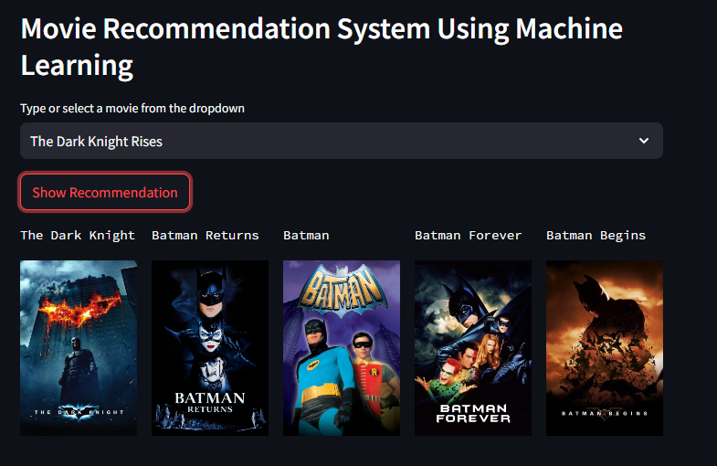

# MOVIES RECOMMENDER SYSTEM USING MACHINE LEARNING
- Recomnmendation systems are becoming increasingly important in today's extremely busy world. People are always short on time with the tasks they need to accomplish in the limited 24 hours. Therefore, the recommendation systems are important as they help them make the right choices, without having to expend their cognitive resources.
- The purpose of a recommendation system basically is to search for content that would be intresting to an individual. Moreover, it involves a number of factors to create personalised lists of useful and interesting content specific to each user/individual. Recommendation systems are Artificial Intelligence based algoritms that skim through all possible options and create a customized list of items that are intresting and relevant to an individual. These results are based on their profile, search/browsing history, what other people with similar traits/demograhpics are watching, and how likely are we to watch those movies. This is achieved through predictive modeling and heurisitc with data available.

# Types of Recommendation System
1. Content Based :
    - Content-bases systems, which use charactersistic information and takes item attributes into consideration.
    - Twitter, Youtube
    - Which music we are listening, what singer are we watching. Form embeddings for the features.
    - User specific actions or similar items recommendation.
    - It will create a vector of it.
    - These systems make recommendations using a user's item and profile features. They hypothesize that if a user was interested in an item in the past, they will once again be interested in it in the future.
    - One issue that arises is making obvious recommendations because of excessive specialization (user A is only interesetd in categories B, C and D, and the system is not able to recommend items outside those categories, even though they could be intresting to them).
2. Collaborative Based : 
    - Collaborative filtering systems, which are based on user-item interactions.
    - Clusters of users with same ratings, similar users.
    - Book recommendation, so use cluster mechanism.
    - We take only one parameter, rating or comments.
    - In short, collaborative filtering systems are based on the assumption that if a user likes item A and another user likes the same item A as well as another item, item B, the first user could also be interested in the second item.
    - Issuses are : 
        - User-Item nxn matrix, so computationally expensive.
        - Only famous items will get recommended.
        - New items might not get recommended at all.
3. Hybrid Based : 
    - Hybrid systems, which combine both types of information with the aim of avoiding problems that are generated when working with just one kind.
    - Uses : word2vec, embedding

# About the project 
- This is stremlit web application that can recommend various kinds of similar movies based on and user interest. 

## Demo
- 
- 
- 

## Dataset Used
- Kaggle : [Link](https://www.kaggle.com/datasets/tmdb/tmdb-movie-metadata)

## Concept used to build the model.pkl file : Cosine Similarity
1. Cosine similarity is a metric that allows us to measure the similarity of documents.
2. In order to demonstrate cosine similarity function we need vectors. Here vectors are numpy array.
3. Finally, once we have vectors, we can call cosine_similarity() by passing both vectors. It will calculate the cosine similarity b/w these 2.
4. It will be a value b/w [0, 1]. If it is 0 then both vectors are complete different. But in the place of that if it is 1, it will be completely similar.

## How to run?
1. Clone the repository
```bash
git clone https://github.com/entbappy/Movie-Recommender-System-Using-Machine-Learning.git
```
2. Check whether the python is installed. If not install python interpreter.
3. Install the requirements
```bash
requirements.txt
```
4. Run the python notebook file
```bash
Recommender System.ipynb
```
5. Run the streamlit to launch the webpage
```bash
streamlit run app.py
```